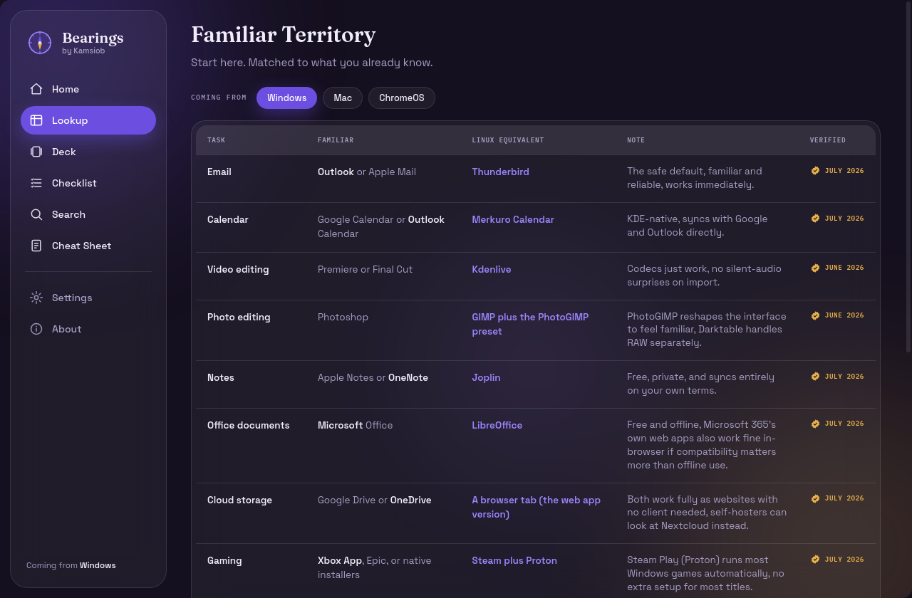
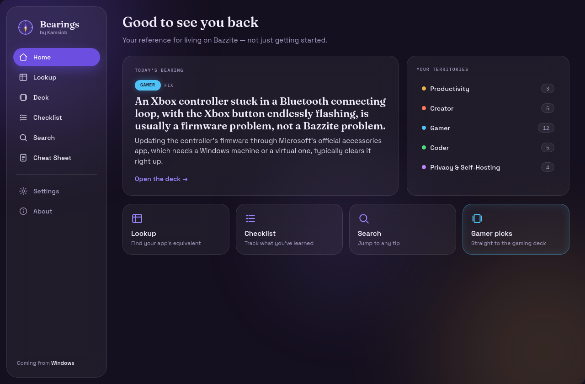
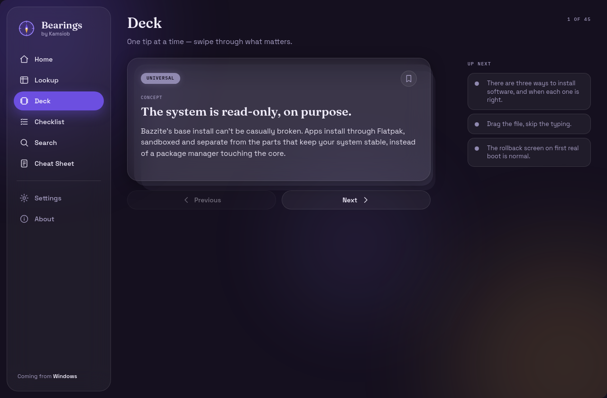
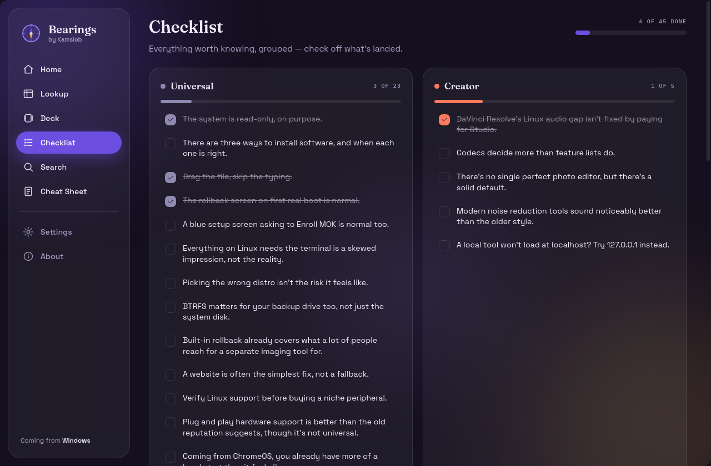
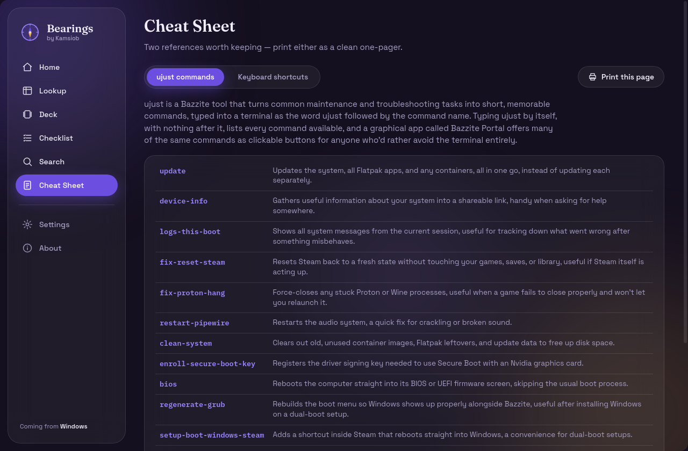

<h1 align="center">Bearings <sub><sup>by Kamsiob</sup></sub></h1>

<p align="center">
  A living field guide for people switching to <a href="https://bazzite.gg">Bazzite</a> —
  the gaming-focused, immutable, Fedora-based Linux distro.
  The things a newcomer doesn't know to ask about yet, a lookup table matching the apps
  you already use to their Linux equivalents, and a reference worth coming back to.
</p>

<p align="center">
  
  
  
  
</p>

<p align="center">
  
</p>

<table align="center">
  <tr>
    <td></td>
    <td></td>
  </tr>
  <tr>
    <td></td>
    <td></td>
  </tr>
</table>

> **Everything stays local. No accounts, no telemetry, no analytics, nothing phones home.**
> The only time Bearings touches the internet is one *opt-in* content-update check against a
> public file on GitHub, and when you tap an external link (opens your browser) or the feedback
> link (opens your mail app). It makes no other network calls — no CDN fonts, no `fetch`, no
> browser storage.

Built with **PySide6 + QtWebEngine**: the interface is local HTML/CSS/JS in a `QWebEngineView`,
with a thin Python layer underneath (over `QWebChannel`) handling local file reads/writes, the
window, and that single outbound update request.

---

## Screens

- **Home** — a returning-user landing page: a rotating *Today's bearing*, your *territories*
  (categories with live counts), and quick tiles.
- **Lookup** *(Familiar Territory)* — a table mapping tasks to Linux equivalents, tuned to the
  system you're coming from.
- **Deck** — one tip at a time, filtered to your focus areas, with bookmarks.
- **Checklist** — every tip grouped by category, checkable, with progress that persists.
- **Search** — instant, on-device filtering across every tip.
- **Cheat Sheet** — two printable one-pagers (ujust commands, KDE keyboard shortcuts).
- **Settings** — change your platform/categories anytime; opt into content updates.
- **About** — links, feedback, and the promises above.

## Run it from source

```bash
python3 -m venv .venv
source .venv/bin/activate
pip install -r requirements.txt
python app.py
```

First launch shows a two-question onboarding (platform + focus areas), then lands on **Lookup**.

## Where your data lives

Nothing leaves the machine. Two local JSON files, following the XDG spec:

| File | Location | Holds |
|------|----------|-------|
| `state.json` | `~/.config/bearings/` | platform, categories, checklist, bookmarks, update toggle, last-checked, cached content version |
| `content.json` (cache) | `~/.local/share/bearings/` | the active content, seeded from the bundled copy, replaced only when a newer version is pulled |

To fully reset the app, delete `~/.config/bearings` and `~/.local/share/bearings`.

## The content JSON (editing tips & equivalents)

All tips and lookup entries live in **`content/content.json`** — a single file with a top-level
`version` string. Edit it directly; bump `version` (dotted integers, e.g. `1.0.0` → `1.1.0`) so
clients recognise it as newer.

```jsonc
{
  "version": "1.0.0",
  "tips": [
    {
      "id": 1,
      "category": "universal",   // universal | productivity | creator | gamer | coder | privacy
      "tag": "Concept",          // Concept | Trick | Fix | Gotcha | Reassurance | Habit (closed list)
      "title": "…",
      "body": "One to three sentences."
    }
  ],
  "lookup": [
    {
      "id": 1,
      "task": "Email",
      "familiar": "Outlook or Apple Mail",   // the app being replaced
      "linux": "Thunderbird",
      "note": "One honest line about the trade-off.",
      "verified": "July 2026"
    }
  ]
}
```

Categories and tags are **closed vocabularies** — don't invent new ones.

The app ships with this file bundled, so it works fully offline from first launch. In **Settings**,
an opt-in toggle (off by default) checks a public copy on GitHub for a newer `version` and swaps it
in; a **Check now** button does a one-off pull. Any failure is silent and keeps the cached copy.

> **Note on the update source.** The check fetches
> `raw.githubusercontent.com/kamsiob/bearings/main/content/content.json`. This repository is
> **private**, so that raw URL isn't publicly reachable yet and the check will simply no-op
> (keeping the bundled/cached copy) until `content/content.json` is served from a public location —
> e.g. by making the repo public, or by pointing `CONTENT_UPDATE_URL` in `bearings/config.py` at a
> public mirror. Nothing about the user or device is ever sent; as with any web request, the source
> IP is visible to GitHub for that one request.

## Cheat sheets

The two one-pagers also live in the repo as standalone, print-ready PDFs (light background, dark
ink) so they can be opened and printed without launching the app:

- `cheatsheets/ujust-commands.pdf`
- `cheatsheets/keyboard-shortcuts.pdf`

Both are generated from `content/cheatsheets.json` (single source, shared with the in-app *Print
this page* button). Regenerate them with:

```bash
python scripts/build_cheatsheet_pdfs.py
```

## Build & install the desktop app

```bash
pip install -r requirements-dev.txt   # adds PyInstaller
scripts/build.sh                       # -> dist/bearings/  (runs without a Python env)
scripts/install.sh                     # installs into the KDE app menu under ~/.local
```

`install.sh` places the bundle, launcher, icons, and `com.kamsiob.bearings.desktop` under
`~/.local` (no root needed); `scripts/uninstall.sh` removes them cleanly. After installing, launch
**Bearings** from the app menu or run `bearings`.

## Project layout

```
app.py                     PySide6 window + QWebChannel bridge
bearings/                  thin Python layer
  backend.py               slots/signals exposed to the UI
  config.py                local state + content cache + update check (only place it writes/fetches)
  cheatsheet_pdf.py        print-friendly cheat-sheet renderer (app + standalone PDFs)
web/                       the interface (HTML/CSS/JS), bundled fonts, no CDN
content/                   content.json (tips + lookup) and cheatsheets.json
cheatsheets/               standalone print-ready PDFs
assets/                    icon.svg + rasterized PNGs
packaging/                 com.kamsiob.bearings.desktop
scripts/                   build / install / uninstall / PDF generation
bearings.spec              PyInstaller build definition
```

## License

[MIT](LICENSE) — free and open source. Fonts (Fraunces, Space Grotesk, IBM Plex Mono) are bundled
under the SIL Open Font License; see `web/fonts/LICENSES.md`.
